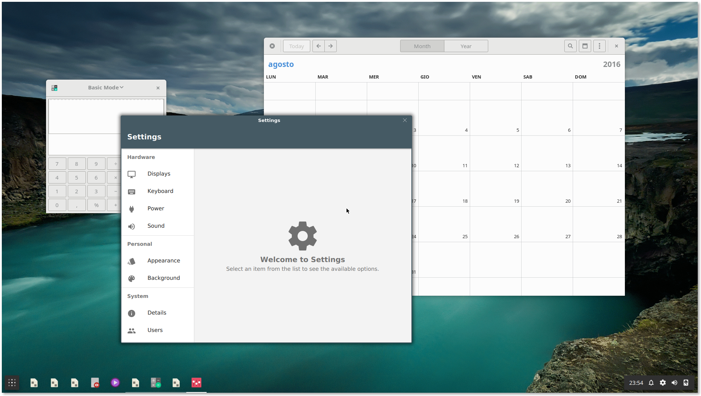

Shell
=====

[](https://zenhub.io)

[](https://www.gnu.org/licenses/gpl-3.0.html)
[](https://github.com/lirios/shell)
[](https://travis-ci.org/lirios/shell)
[](https://github.com/lirios/shell/issues)
[](https://github.com/lirios/shell/commits/develop)

Responsive shell for the Liri desktop.



## Dependencies

Compiler requirements:

* [gcc >= 4.8](https://gcc.gnu.org/gcc-4.8/) or
* [Clang](http://clang.llvm.org/)

Qt >= 5.10.0 with at least the following modules is required:

 * [qtbase](http://code.qt.io/cgit/qt/qtbase.git)
 * [qtdeclarative](http://code.qt.io/cgit/qt/qtdeclarative.git)
 * [qtwayland](http://code.qt.io/cgit/qt/qtwayland.git)
 * [qtgraphicaleffects](http://code.qt.io/cgit/qt/qtgraphicaleffects.git)
 * [qtquickcontrols2](http://code.qt.io/cgit/qt/qtquickcontrols2.git)
 * [qtsvg](http://code.qt.io/cgit/qt/qtsvg.git)

The following modules and their dependencies are required:

 * [qbs](http://code.qt.io/cgit/qbs/qbs.git) >= 1.9.0
 * [qbs-shared](https://github.com/lirios/qbs-shared.git) >= 1.2.0
 * [fluid](https://github.com/lirios/fluid) >= 1.0.0
 * [qtaccountsservice](https://github.com/lirios/qtaccountsservice) >= 1.2.0
 * [qtgsettings](https://github.com/lirios/qtgsettings) >= 1.1.0
 * [libliri](https://github.com/lirios/libliri)
 * [liri-wayland](https://github.com/lirios/wayland)
 * [liri-workspace](https://github.com/lirios/workspace)
 * [pam](http://www.linux-pam.org/)
 * [libqtxdg](https://github.com/lxde/libqtxdg)

## Installation

Qbs is a new build system that is much easier to use compared to qmake or CMake.

If you want to learn more, please read the [Qbs manual](http://doc.qt.io/qbs/index.html),
especially the [setup guide](http://doc.qt.io/qbs/configuring.html) and how to install artifacts
from the [installation guide](http://doc.qt.io/qbs/installing-files.html).

If you haven't already, start by setting up a `qt5` profile for `qbs`:

```sh
qbs setup-toolchains --type gcc /usr/bin/g++ gcc
qbs setup-qt $(which qmake) qt5 # make sure that qmake is in PATH
qbs config profiles.qt5.baseProfile gcc
```

Then, from the root of the repository, run:

```sh
qbs -d build -j $(nproc) profile:qt5 # use sudo if necessary
```

To the `qbs` call above you can append additional configuration parameters:

 * `modules.lirideployment.prefix:/path/to/prefix` where most files are installed (default: `/usr/local`)
 * `modules.lirideployment.dataDir:path/to/lib` where data files are installed (default: `/usr/local/share`)
 * `modules.lirideployment.libDir:path/to/lib` where libraries are installed (default: `/usr/local/lib`)
 * `modules.lirideployment.qmlDir:path/to/qml` where QML plugins are installed (default: `/usr/local/lib/qml`)
 * `modules.lirideployment.pluginsDir:path/to/plugins` where Qt plugins are installed (default: `/usr/local/lib/plugins`)
 * `modules.lirideployment.qbsModulesDir:path/to/qbs` where Qbs modules are installed (default: `/usr/local/share/qbs/modules`)

See [lirideployment.qbs](https://github.com/lirios/qbs-shared/blob/develop/modules/lirideployment/lirideployment.qbs)
for more deployment-related parameters.

You can also specify the following options:

 * `projects.Shell.developmentBuild:true` to enable features for development such as the ability
   to load arbitrary QML files from the shell
 * `projects.Shell.systemdUserUnitDir:/path/to/units` to install systemd user units (default: `/usr/local/lib/systemd/user`),
   the prefix can be changed setting `modules.lirideployment.prefix`

## Licensing

Licensed under the terms of the GNU General Public License version 3 or,
at your option, any later version.

## Notes

### Logging categories

Qt 5.2 introduced logging categories and Liri Shell takes advantage of
them to make debugging easier.

Please refer to the [Qt](http://doc.qt.io/qt-5/qloggingcategory.html) documentation
to learn how to enable them.

### Available categories

 * Compositor:
   * **liri.compositor:** Compositor
   * **liri.processlauncher:** Process launcher and application tracker
   * **liri.screensaver:** Lock, idle and inhibit interface
   * **liri.session:** Manages the session
   * **liri.loginmanager:** login manager subsystem
   * **liri.loginmanager.logind:** login manager subsystem (logind backend)

 * Launcher QML plugin:
   * **liri.launcher:** Launcher model and items
   * **liri.launcher.appsmodel:** Applications model

## Components

*liri-shell*

Compositor executable.

*liri-session*

Manages the session, drives the compositor, runs autostart programs
and launches applications for the application launcher.

Autostarts the D-Bus session if needed and can logout an existing
session with:

```sh
liri-session --logout
```

## Running on another window system

By default the Liri session runs without a particular window system and uses
DRM/KMS or a device specific EGL integration.

However you can run it inside another window system.

### X11

To run windowed inside a X11 session:

```sh
liri-session -platform xcb
```

### Wayland

To run windowed inside a Wayland session:

```sh
liri-session -platform wayland
```

Some compositors, such as Weston, support the fullscreen-shell protocol that
allows a compositor to be nested into another compositor.

Let's take Weston as an example. First you need to run it with the fullscreen-shell
protocol enabled:

```sh
weston --shell=fullscreen-shell.so
```

Then you need to run `liri-session` like this:

```sh
QT_WAYLAND_SHELL_INTEGRATION=fullscreen-shell liri-session -platform wayland 
```

## Fake screen configuration

You can simulate a fake screen configuration on X11 and Wayland.

Run:

```sh
liri-session -platform xcb --fake-screen screenconfig.json # replace xcb with wayland if you are running on Wayland
```

Here's the contents of `screenconfig.json`:

```json
{
	"outputs": [{
		"name": "Screen 1",
		"primary": false,
		"scale": 1,
		"position": {
			"x": 0,
			"y": 0
		},
		"mode": {
			"size": {
				"width": 1024,
				"height": 768
			},
			"refreshRate": 60000
		},
		"physicalSize": {
			"width": 350,
			"height": 260
		}
	},
	{
		"name": "Screen 2",
		"primary": true,
		"scale": 1,
		"position": {
			"x": 1024,
			"y": 0
		},
		"mode": {
			"size": {
				"width": 1024,
				"height": 768
			},
			"refreshRate": 60000
		},
		"physicalSize": {
			"width": 350,
			"height": 260
		}
	}]
}
```

## QML JavaScript debugger

Developers can debug Liri Shell with Qt Creator and the QML JavaScript debugger.

Set the debug port and run the shell:

```sh
liri-session -qmljsdebugger=port:3768
```

In the example above we are using the default port which is 3768.
Now from Qt Creator click on Debug -> Start Debugging -> Attach to QML port and specify
the 3768 port.

See the [Qt Creator manual](http://doc.qt.io/qtcreator/creator-debugging-qml.html) for more information.
